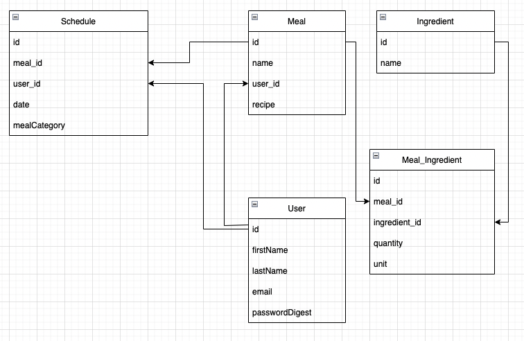

# Milestone Project 3 - Meal Tracker
by Robert Behm

## Description
Meal Tracker is a meal planning and nutrition tracking app where users can plan their future meals and track the nutrition content of the meals. A user will be able to log into the site and build meals with recipes, ingredients, and include a URL link or photo. The meals will then be able to be added to a weekyly calendar view to plan for the upcoming week. The daily nurition data will be taken from the ingredients list of each meal and tallied to show the user an estimate what calorie/macro/nutrition quantities they consumed that day. When planning for the next week of food, ingredients from the meals will be able to be added to a shopping list. Meals will be able to be tagged in user specified categories to organize their meals better. 

## Technologies
This is a PERN (PostgresSQL, Express, React, Node JS) full stack web application that uses JWT for authentication. 

## Technical Information
The following entity-relationship diagram was developed to map out the variables and their relationships:

## Known Issues
11-01-2022-- The schedule and ingredient variables and views are still being built out. Nutrition data will need to be pulled from an API. 